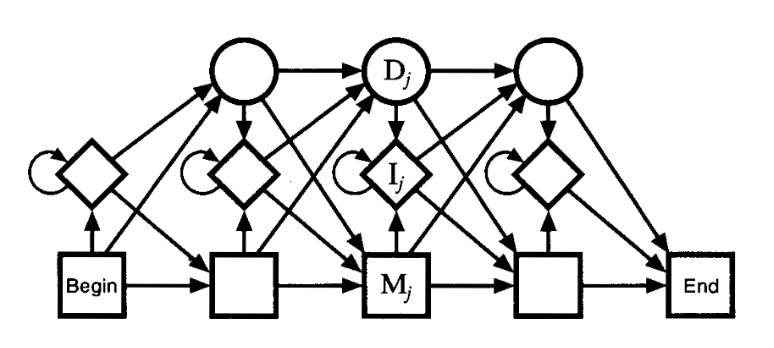

# HMM-Based Protein Domain Classification

> **Author:** Domagoj Sviličić  
> **Supervisor:** Doc. Dr. Sc. Krešimir Križanović  
> **Institution:** University of Zagreb, Faculty of Electrical Engineering and Computing  
> **Date:** May 2025

##  Overview

This repository presents an implementation of **Hidden Markov Models (HMMs)** for **domain-level classification of protein sequences**. The approach combines probabilistic modeling with biological prior knowledge derived from **Pfam**'s curated sequence alignments. The primary goal is to accurately assign unknown protein sequences to their respective functional domains using profile-HMMs.

---

##  Key Concepts

- **Profile Hidden Markov Models (HMMs)** for biosequence modeling
- **Pfam database** seed alignments as training data
- **Multiple Sequence Alignment (MSA)** to capture conserved biological patterns
- **Explicit parameter estimation** of emission and transition matrices
- **Forward algorithm** for sequence likelihood estimation
- **Log-odds scoring** relative to a background model

---

##  Project Structure

- `data/` – contains seed alignments and test sequences  
- `scripts/` – Python scripts for model training and R scripts for classification  
- `results/` – Log-odds scores, visualizations, and HMM diagrams  
- `report/` – PDF of the full seminar paper  
- `README.md` – this file

---

##  Model Construction

The construction of a profile-HMM is based on curated Pfam alignments. For each domain:
1. Conserved columns are identified.
2. States (`Match`, `Insert`, `Delete`) are determined.
3. Transition and emission probabilities are computed explicitly.
4. Laplace smoothing is applied to avoid zero-probability issues.

**Model Topology Example:**



> *Figure: Topology adapted from Durbin et al.*

---

## 🔍 Classification Pipeline

Unknown protein sequences are classified via:

1. **Sliding window approach** based on average domain lengths  
2. **Forward algorithm** to compute `log(P(sequence | model))`  
3. **Background model** used for normalization  
4. **Log-odds score** used for final classification:

```math
log\_odds = log(P(sequence | HMM)) - log(P(sequence | background))
